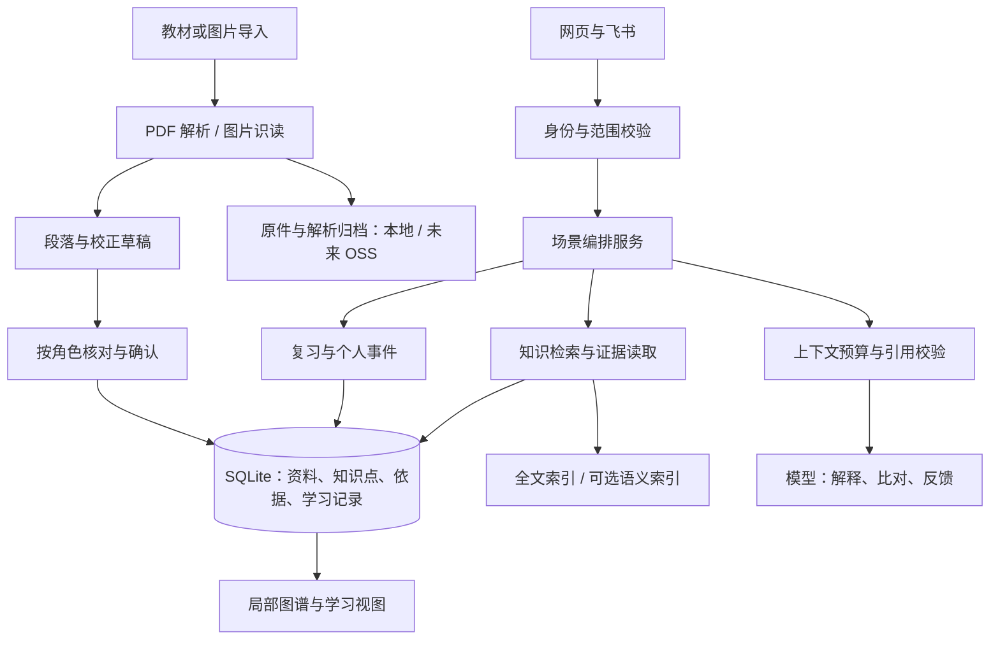

# 知识库 V2：教材依据、遗忘记录、检索与图谱设计

日期：2026-09-26。状态：完整设计目标，主学习流程已在本地实现，尚未部署。完成项、剩余项及验证记录见 [本次实现说明](KNOWLEDGE-V2-IMPLEMENTATION.md)，本文所有设计目标不能视为均已完成。PDF 已调整为本地离线解析，后文“导入”指核对后的资料合并，不代表线上解析入口。关联说明：[检索工具与场景流程](KNOWLEDGE-RETRIEVAL-TOOLS.md)。

本方案承接用户提出的五项工作：数据分层与上下文限制；教材检索；图片教材校正；背诵反馈与局部图谱；检索质量、抽查与排程优化。以现有 Node.js 服务、网页、飞书和 MinerU 为基础渐进改造。当前只有一名学习者羊羊，管理员维护资料、查看学习情况；管理员不代答、不代自评。

## 1. 产品目标与核心决策

教材回答“依据是什么”，知识点回答“需要掌握什么”，学习记录回答“羊羊何时忘记、复习得怎样”。三者关联，但不共用同一条记录。

1. PDF 导入产生教材资料和可检索段落，不自动表示羊羊学过或遗忘。
2. 羊羊提交的遗忘照片经确认关联知识点，并记录该次遗忘；原上传日期仍是遗忘起点。
3. 知识点具有稳定 ID；同一知识点可对应多本教材、多个原文片段和多次照片记录。
4. 原图转写、教材原文、整理答案分别保留。教材依据不能悄悄覆盖原图转写。
5. 问答、图片比对、背诵反馈、网页图谱使用同一套知识与证据服务。
6. Agent 每次按需取得有限内容；所有模型入口共用上下文预算。
7. 初期采用 SQLite 与 FTS5，附件保存在现有持久目录；对象存储作为可替换后端，当前不开通。向量检索按评测结果接入，不把独立向量服务列为前置条件。
8. 初期由后端明确编排检索工具，不依赖模型自行决定每一步，也不要求先扩展现有模型供应商的 function calling。

## 2. 与现有实现的差异

| 当前实现 | V2 目标 |
|---|---|
| 图片/PDF 入库后同样投影成遗忘知识点 | 资料类型与学习事件分开 |
| 自然问答主要匹配标题，最多 5 条 | 标题、别名、章节和正文全文检索；后续增加语义召回 |
| 图片识读后联网核验 | 优先检索授权教材并比对，外网核验明确分为另一证据来源 |
| PDF 页码存在导入记录，投影和检索结果未完整携带 | 段落、答案依据、检索返回和反馈快照均保留页码 |
| 反馈主要是结构性建议 | 有已审核答案时逐要点反馈；缺少依据时保留结构建议 |
| 单 JSON 每次整库加载与重写 | 单机事务数据库按 ID、状态、索引读取 |
| 管理员问答携带完整 dashboard | 专用摘要 DTO；任务列表按需分页 |
| 网页全量知识条目刷新 | 索引分页、详情按需、图谱局部加载 |

代码现状依据：`knowledge/library.js`、`knowledge/pdf-import.js`、`knowledge/service.js`、`ark/agent.js`、`ark/feedback.js`、`feishu/bot.js`、`domain/plan.js`。以上是本地审计结果，不表示线上已经同步当前代码。

## 3. 总体结构



文件、数据库、索引的职责：

- 原 PDF、原图和完整解析产物使用 `AssetStore` 保存，数据库记录不可变文件标识和 SHA256。
- 正文、页码、知识点、已确认答案、证据关联、个人事件以数据库为准。
- 全文/语义索引是可重建的派生数据，丢失后重建，不反过来成为唯一知识来源。
- 运行数据库保存在服务器持久卷，不挂到 OSS。模型运行依赖与临时解析空间仍留在计算节点。

## 4. 数据模型

以下为逻辑表，不要求一张表对应一个独立服务。各表统一带创建时间、更新时间；适用对象带工作区/访问范围、状态和版本。

| 实体 | 关键字段 | 约束 |
|---|---|---|
| `source_documents` | id、kind、title、edition、library_id、scope_key、current_revision | kind 为 textbook / forgotten_photo / supplemental / legacy_unknown；不能按扩展名判断学习意图 |
| `source_revisions` | source_id、revision、asset_key、sha256、parser_version、parse_status、review_status | 原件和解析版本不可变；parse_status 与人工审核状态分开 |
| `source_parts` | revision_id、part_index、asset_key、page_mapping | 支持现有分卷 PDF；未知原书页码不推断 |
| `source_chunks` | id、revision_id、chapter_path、text、text_hash、anchors、quality_flags、review_status | anchors 保存 part、PDF 页码、原文字块、坐标和字符区间；可以跨页；段落核对状态独立记录 |
| `knowledge_points` | id、title、subject、aliases、status、current_answer_version | 稳定概念 ID；不因重新解析换 ID；同名不自动合并 |
| `answer_versions` | point_id、version、outline、status、reviewed_by、reviewed_at | draft / reviewed / disputed / superseded；不把整本书的一次确认视为所有答案都通过审核 |
| `answer_items` | answer_version_id、item_id、text、required、order | 可逐项比较的答案要点；与参考原文分开 |
| `evidence_links` | answer_item_id、chunk_id、source_revision、quote、anchor、relation、review_status | relation 为 supports / contradicts / supplements；确认后的引用固定版本 |
| `point_relations` | from_id、to_id、type、status、origin、evidence_ids | 包含、前置、对比、易混淆；模型生成先为 candidate |
| `photo_drafts` | source_revision_id、ocr_reads、aligned_text、uncertainties、proposed_point_ids、corrections、status | 原图转写与教材校正并存，版本乐观锁防止确认过期草稿 |
| `photo_point_links` | photo_id、point_id、confirmed_by、confirmed_at | 一张照片可关联多个知识点；关联确认前不写学习事件 |
| `learning_events` | id、learner_id、point_id、type、occurred_at、source_id、idempotency_key | forgotten / review / enrollment；时间线事实追加保存 |
| `review_states` | learner_id、point_id、next_review_on、interval、rating_state、scheduler_version | 每个学习者与知识点唯一；只由明确学习行为更新 |
| `learning_enrollments` | learner_id、point_id、status、reason | 明确哪些教材知识点进入个人学习/抽查范围 |
| `retrieval_runs` | id、purpose、index_version、query_hash、hit_ids、budget_usage、latency、outcome | 原始查询默认不进入长期日志；调试样本单独授权或使用合成数据 |
| `feedback_jobs` / `answer_feedbacks` | 沿用现有任务、幂等与快照字段，增加 answer_version、evidence_snapshot、feedback_mode | 既有答案、反馈和自评完整保留；旧反馈不随新教材改写 |
| `migration_mappings` | legacy_type、legacy_id、new_id、classification、reason | 历史映射可审计、可回查 |

一次确认建立的原文依据必须同时标明“在哪里”“引用了什么”“支持哪个要点”。PDF 文件中的第 18 页不自动等于书上印刷第 18 页；界面默认显示 PDF 页码，印刷页码有核验映射才显示。

稳定 ID 示例：两张不同照片涉及同一个概念，两个 source_id 对应一个 point_id、两次不同 learning_event。去重按消息/上传操作幂等键；不同时间重拍同一张图片仍可能是一次新的真实遗忘，不按文件哈希吞掉学习事件。

数据库启用外键；至少建立 `(source_id, revision)`、`(point_id, version)`、`(learner_id, point_id)`、`learning_events.idempotency_key` 唯一约束，以及按范围/状态、到期日、资料版本、图谱端点的查询索引。照片确认时，草稿版本校验、知识点关联、学习事件和学习状态在同一事务内提交。全文索引同步更新；可选语义索引使用持久化待更新任务，索引未就绪时继续使用全文检索，不能让两套索引混淆当前版本。

## 5. 权限、状态与旧规则兼容

### 5.1 权限

资料维护与学习操作拆为独立权限，服务器从登录/飞书身份派生，不接受模型指定 actor、learner_id 或授权范围。

| 操作 | 管理员 | 羊羊 |
|---|---|---|
| 查看获准共享教材与知识 | 是 | 是 |
| 上传教材、修改教材元数据、审核教材转写、审核参考答案 | 是 | 是 |
| 提交个人遗忘照片 | 可代上传为待羊羊确认草稿 | 是 |
| 确认个人照片关联与遗忘事件 | 否 | 是 |
| 查看羊羊学习数据 | 私聊/Web 只读 | 是 |
| 提交答案、自评、选入个人学习范围 | 否 | 是 |
| 建议或审核资料关系 | 是 | 是；不能借关系扩大资料权限 |

这是 V2 对“管理员维护教材”的能力扩展；管理员对学习记录仍保持只读。当前 Web 把管理员所有写请求都拦截，实施时必须改为按操作鉴权，不能简单删除角色检查。

共享教材通过 library_id 的明确授权进入配置主群和允许的私聊；独立群/话题不因同名资料自动继承权限。群中不展示个人学习事件；局部图谱中的个人状态只在获准的 Web/私聊返回。未绑定用户不可读取私有知识。

### 5.2 入库状态

- 教材：上传 → 解析 → 可核对 → 可检索参考；经人工核对的段落可作为答案审核依据。
- 答案：候选要点与引用 → 人工审核 → reviewed；冲突为 disputed。
- 照片：两次识读 → 对齐 → 教材检索比对 → 待确认 → 关联知识点并记录遗忘。
- “可检索”不等于“可作为正确答案”。未核对内容能帮助定位，但回答必须带状态，不能用于确定性纠错。
- 旧 unresolved 资料仍可自主回忆，反馈降级为结构建议；不追溯升级其可信状态。
- 教材新版本激活时，将依赖旧版且内容变化的答案列入待复核；原快照保留。新练习不默默沿用 disputed 答案作为确定依据。

### 5.3 遗忘与排程

保留此前已经确认的规则：羊羊的遗忘照片按原上传日进入待复习，全部待复习内容都可访问，不伪造首次学习日期，不因资料修订重置状态。

列表可以每页 5 条并显示总数与“全部待复习”，但不能只留下 5 条、删除其他待办。Agent 默认得到“总数 + 最多 5 条摘要”，进一步读取需分页。同日重复消息不会重复记录；新的真实遗忘可更新当前状态，但旧消息延迟确认不得覆盖更晚的实际复习。

教材导入不创建 forgotten 事件。人工选入学习范围产生 enrollment，未知首次学习日期保持空。

## 6. 教材导入与索引

1. 管理员填写/核对资料类别、书名、版本、学科和共享范围。用户提到的三本教材需在实施导入时对应实际文件，不假定已在运行库中。
2. 保存原件与哈希；同一权限范围内同一文件识别重复，重试复用已有有效产物。
3. 沿用 MinerU，优先保持当前 10MB / 30 页 / 串行限制。整本教材可按现有限制分卷，登记为同一本书的 parts；不因本方案直接放开解析资源限制。
4. 保留逐页原始块与空白/疑难标记，去掉重复页眉页脚时仍保留原件定位。
5. 按章节、段落、列表、定义和表格边界组成检索片段。初始目标每片约 500–1000 中文字符，最长约 1500；属于可调参数，不是强制截断句子。完整长表/列表保存父段落，检索子片可回读父段落。
6. 跨页答案用多个 anchors；相邻片段保留顺序。必要重叠仅为检索，回答打包时去重。
7. 构建标题/别名、章节和正文的全文索引。索引写入与对应数据库变更在事务内提交；一次新解析全部成功后才切换活动版本。
8. 候选知识点和答案先做成草稿，由人核对。解析片段不自动等同一个知识点。

解析与校正任务持久化状态为 queued / running / succeeded / failed / interrupted，记录输入哈希、阶段、尝试次数和产物位置。成功产物可复用；失败重试不重复建立资料或事件。重启后已进入外部模型请求但结果未知的任务标为 interrupted，避免自动重复付费调用；用户明确重试时产生可追踪的新尝试。串行解析与队列上限先沿用现状，不增加多个应用写入进程。

全文检索采用 FTS5 与 BM25 相关性排序。中文原文另存，不直接依赖默认分词处理长中文句子：初版使用可版本化的中文预分词、学科术语/别名表与短词匹配方案，先在真实资料评测集验证再锁定具体依赖；分词、字典或切块规则变化必须触发索引重建。FTS 查询表达式由服务端构建，参数化 SQL，不直接执行模型给出的 SQL 或 FTS 语法。[SQLite FTS5 官方文档](https://www.sqlite.org/fts5.html)

## 7. 检索与模型调用

具体入参、返回、示例、无命中和权限行为见[检索工具说明](KNOWLEDGE-RETRIEVAL-TOOLS.md)。工具层与 HTTP/模型 SDK 解耦；网页、飞书、图片处理与反馈调用同一服务。

基础工具：

- `search_knowledge`：按目的查知识点或教材片段，返回候选与短摘录。
- `get_knowledge_point`：按稳定 ID 取得答案版本、要点与依据 ID。
- `get_source_excerpt`：按不可变片段 ID 取得原文及页码，按预算少量扩展相邻段落。
- `get_related_points`：查询已确认关系，供局部图谱和对比学习。

学习状态使用独立 `list_due_points`、`get_learning_summary` 服务；不混入教材全文检索。写入仍通过现有学习服务和显式确认接口执行。

普通问答先查知识点及已审核答案，同时查教材补充；图片校正优先查教材；背诵反馈已知 point_id，优先直接读取绑定的答案与证据。查询目的由可信后端场景设定，模型不能把普通聊天改成自动审核/保存。

初版在后端完成固定顺序。低召回时最多补一次受限的查询改写；未来若启用 function calling，同一工具执行器、权限检查和总预算仍有效。

## 8. 上下文预算与性能

所有入口，包括 classify、私聊 chat、coach、群内知识问答、管理员问答、照片比对和反馈，经过 `ContextBuilder`。不能在 system prompt 中偷偷拼入完整 dashboard。

以下为初始设计预算，实施时按所用模型的实际上下文上限与 tokenizer 校验并取更小值：

| 项目 | 默认约束 |
|---|---|
| 文本任务整次输入 | 不超过 12,000 tokens；还需预留输出及安全余量 |
| 知识证据总预算 | 最多 6,000 tokens，包含所有工具读取与相邻片段 |
| 检索返回 | 默认 5 条、最多 8 条短摘录；搜索候选内部最多 40 条 |
| 查询次数 | 单次问答最多 2 次 search，总共最多 4 次读取工具调用；批处理按知识条目拆成有界任务 |
| 历史 | 最多 6 轮，同时限制总 token；按需要缩短 |
| 今日摘要 | 总数 + 最多 5 条短标题，无参考正文 |
| 单次反馈 | 限定本知识点的题干、用户答案、答案要点及必要原文 |

预算分配顺序：身份/规则、当前问题或答案、必要证据、任务摘要、最近对话。超出时先减少无关历史、重复片段，再缩小问题范围；不能从一段定义中截掉否定词/条件后仍当完整证据。长答案按要点分批处理，汇总时保留证据和未处理范围。

可靠 tokenizer 尚未就绪时，用保守的 UTF-8 字节预算作为临时约束并在适配器中验证，不能把“字符数”等同 token 数或宣称精确上限。图片 OCR 独立限制图片数量、像素、请求大小和供应商视觉用量；上述文本预算不替代视觉输入预算。

整套资料不能只依靠内存缓存保住性能：列表字段投影、正文按 ID 取、事务性索引、分页、避免每次读取重算全库学习状态。PDF 任务列表仅返回状态摘要，逐页预览再取正文，避免当前轮询反复携带全量 parsed。

初始压测目标（非现有性能承诺）：10,000 个片段时暖缓存本地全文检索 P95 < 500ms；1,000 条待办不增加模型输入上限；图谱初次最多 50 节点/100 条关系。记录真实服务器 CPU、内存、并发、解析负载再验收，不推断 40GB 服务器的算力。

## 9. 图片教材校正

OCR 忠实转写与知识校正分成两个阶段，原图的疑点不因教材有答案而消失。

1. 两次 OCR、对齐与差异标注沿用现有能力。
2. 按候选知识点拆成有界校正任务，提取标题、人物、关键词、疑似错字。
3. 先从授权教材召回相关原文，读取必要相邻段落，保留证据 ID。
4. 模型输出结构化比对：original_text、suggested_text、change_type、reason、evidence_ids、remaining_uncertainties。change_type 区分 OCR 疑误、笔记遗漏、表述不同、教材冲突。
5. 后端检查引用 ID 属于本次授权结果、页码来自数据库、引用文字与对应版本原文一致；这只检查来源与引用完整性，不等同自动证明结论正确。
6. 展示原图、识读稿、教材摘录、校正建议；羊羊确认个人照片关联与遗忘事件，资料审核者确认参考答案。两种确认可以在同一界面清楚区分。
7. 教材无命中：保留原稿与“未找到教材依据”；可以按明确的核验流程查互联网，外网证据单独标识，不宣称来自教材。普通问答默认不自动走外网。
8. 多本教材冲突：并列展示各自表述、版本和页码，候选答案标 disputed，等待取舍。

网络核验沿用现有能力，但不强制“有 HTTP URL 才算有依据”；内部教材证据改用结构化引用，不制造假网址通过旧校验。

## 10. 背诵、抽查与排程

练习启动时绑定 `point_id + answer_version + evidence_snapshot`。提交答案后按该快照反馈；资料中途修订不能改变本次已经开始的题目依据。新练习使用最新合格版本；重大修订需在当前练习提示。

反馈保存每个要点的结果：covered / partial / missing / contradicted / uncertain，以及对应答案要点、用户答案片段、教材证据 ID 和解释。用户未提及为 missing；明确相反且有证据才是 contradicted；不确定时不能判错。反馈展示事实依据与表达建议，不默认输出总分或官方评分。

无 reviewed 答案、引用被撤销或存在冲突时，回到结构反馈并显示不足，允许羊羊自主回忆和自评。AI 反馈不修改 `review_states`；只有羊羊显式自评或确认的新遗忘事件可以影响排程。

日常选题分开：

- 到期复习：读取学习状态，遗忘优先，所有待办可分页访问。
- 随机抽查：羊羊主动发起，从已选入范围且有合格答案的知识点中按学科/章节抽样；当次不重复，默认排除当天已练。记录抽样集合和结果，方便复现。
- 新知识：明确选择加入个人学习范围；不把 PDF 解析完成自动当成学过。

第 5 阶段评估正式 FSRS：先离线重放真实历史，检查时间/评级映射及缺失事件，不伪造历史评级；保存算法版本与迁移报告，回放核验后独立切换。检索与图谱发布不依赖先完成 FSRS。主动定时推送另属通知产品，不因本方案自动开启。

## 11. 网页局部知识图谱

首版三个区域：左侧按学科/教材/章节导航，中间局部关系图，右侧知识点与原文依据；小屏切为图谱/详情页签。保持现有前端技术，不以整体重写为前提。

节点以知识点为主，教材来源可切换显示。颜色和文字标签表达“今日到期、近期遗忘、已复习、未加入学习”，证据状态使用独立标志，不能混成一个掌握度颜色。当前掌握指标仍是简化算法结果，不显示为测得的遗忘概率。

初始只取当前节点一跳关系，最多 50 节点/100 条边；用户逐步展开。支持搜索定位、按教材/到期筛选、查看原文、开始回忆、显示/隐藏答案、查看本人事件时间线。展开图谱不等于完成学习。

关系必须有类型。已确认边与 AI 候选边分开，候选默认不参与事实回答。环形关系和重复边在服务端处理；相似文本不能直接生成“前置知识”或“因果”边。

图谱查询返回摘要和关系，正文详情另取；不把全图发给模型。关系表可存 SQLite，初期不引入独立图数据库。

## 12. 模块与接口改造

建议新增的模块（命名可在实施时细化）：

```text
apps/api/src/storage/sqlite-repository.js
apps/api/src/storage/migrations/
apps/api/src/storage/asset-store.js
apps/api/src/knowledge/ingest-service.js
apps/api/src/knowledge/retrieval-service.js
apps/api/src/knowledge/evidence-service.js
apps/api/src/knowledge/point-service.js
apps/api/src/knowledge/graph-service.js
apps/api/src/agent/context-builder.js
apps/api/src/agent/knowledge-tools.js
apps/web/knowledge-graph.js
scripts/migrate-knowledge-v2.mjs
scripts/evaluate-retrieval.mjs
```

现有 `knowledge/library.js` 不再在每次读写中全量投影；`pdf-import.js` 委托资料导入服务；`knowledge/service.js` 接教材比对；`StudyService` 消费稳定 point_id；`FeedbackService` 保留异步任务与快照；`ark/agent.js` 和群聊适配器统一接检索/上下文服务。

新增 HTTP 入口使用 `/api/knowledge-v2/`，与旧端点暂时共存：

| 接口 | 用途 |
|---|---|
| `GET /sources?cursor=...` | 教材与资料元信息、导入状态 |
| `GET /sources/:id/parts/:partId/pages/:page` | 按页核对与原文定位 |
| `POST /search` | 只读检索，输入 query 与允许的过滤项 |
| `GET /points?cursor=...`、`GET /points/:id` | 分页目录、单点详情 |
| `GET /points/:id/graph?depth=1&cursor=...` | 有界局部图谱 |
| `POST /sources/:id/reviews` | 按版本提交教材转写核对结果 |
| `POST /points/:id/answer-reviews` | 按 expectedVersion 确认答案与依据 |
| `POST /photo-drafts/:id/confirm` | 羊羊确认个人关联及遗忘 |
| `POST /enrollments`、`POST /spot-checks` | 羊羊选择学习范围、主动抽查 |

上表路径均相对于 `/api/knowledge-v2`。保留现有答案、自评接口；不得因新增只读 POST 检索而错误授予管理员其他写权限。读取服务也要逐项鉴权，不把工具返回 ID 当作授权凭证。

## 13. 数据库迁移与恢复

1. 第 1 阶段先在现有仓储止住新教材的错误遗忘投影、补上下文预算，新增字段向后兼容。
2. SQLite 驱动在实施时根据项目支持的 Node.js 和容器平台选定固定版本，验证 FTS5、备份、事务及构建；不顺带强制升级运行时。
3. 迁移工具默认 dry-run，报告来源分类、条目映射、历史关联、待人工分类项；不修改运行库。
4. 首次迁移为每个旧知识点保留稳定映射；既有练习链接可用旧 ID 查询。无法可靠判定来源的旧导入标 legacy_unknown，不自动删遗忘事件。
5. 错误生成的教材遗忘记录分开修正：没有真实复习的可经迁移核对后标记为撤销/排除；有真实作答、自评的学习记录保留。禁止删除真实学习经历或把今天补成旧日期。
6. 停止写入和任务领取，备份 JSON 与全部附件，记录哈希；先迁入新的数据库文件，核对来源、版本、知识点、事件、答案、反馈任务和文件数。
7. 运行完整性检查、权限检查和只读对比；重建索引。事务成功后切换配置，单一数据库成为唯一写入源，禁止长时间双写 JSON/SQLite。
8. 切换前失败恢复旧配置即可；切换后已有新写入时不能直接回旧 JSON。需停写，备份新库，将增量经核验的反向迁移恢复，或修复 SQLite 后继续运行。
9. SQLite 使用本机持久卷；WAL 的并发收益不代表无限多写者，保留短事务和受控写入。SQLite 在线备份应使用数据库备份机制，不只复制正在写入的主文件而漏掉 WAL。[WAL 文档](https://www.sqlite.org/wal.html) · [备份 API](https://www.sqlite.org/backup.html)
10. 附件使用不可变标识。备份先生成一致数据库快照，再复制快照引用的附件并校验；备份期禁止清理被快照引用的对象。快照、附件清单、哈希与 schema/index 版本组成可恢复备份。索引可以重建。

后续接 OSS 只替换 AssetStore。迁移先复制、校验、切引用；确认恢复演练成功后再决定本地副本保留策略。Git 保留代码和必要样例，大量教材原件不进入常规 Git 历史。

## 14. 五阶段实施与验收

| 阶段 | 工作包 | 出口条件 |
|---|---|---|
| 1：数据身份与上下文 | source kind、个人事件边界、管理员资料权限、统一 ContextBuilder、专用学习摘要 | 导入教材零新增遗忘事件；既有照片日期/历史不变；管理员不能作答；1,000 待办不突破上下文预算 |
| 2：教材依据库与工具 | SQLite 迁移、章节切块、页码、FTS、三个核心检索读取工具、分页查询 | 三本实际教材可核对与搜索；权限外内容零返回；来源定位正确；迁移恢复通过 |
| 3：图片校正 | OCR 原稿保留、教材检索比对、证据关联、答案草稿与确认、重复概念关联 | 真实样本可从校正建议回看教材原页；无命中/冲突不自动定论；重复上传不重复事件 |
| 4：背诵与图谱 | 按要点反馈、答案证据快照、局部关系图、回忆模式与学习筛选 | Web/飞书同一答案版本；修订不改变旧反馈；图谱可从节点进入回忆并自评 |
| 5：质量与学习策略 | 真实评测、按需混合检索/重排、主动随机抽查、FSRS 离线验证与独立切换评估 | 检索/引用指标达标；抽查范围正确；排程迁移不伪造历史；服务器压测有记录 |

依赖顺序：1 → 2 → 3 → 4 → 5；阶段 2 开始即建立评测集，不等阶段 5 才发现检索失败。每阶段独立功能开关、迁移说明和回退条件；不先发布空图谱再补数据。

阶段 1 的第一批具体修改：拆开 PDF 导入用途；停止 textbook 自动初始化遗忘；ContextBuilder 替换管理员整个 dashboard 和其他无界列表；为权限规则增加教材维护能力；增加针对既有日期/自评兼容的测试。

## 15. 验收数据与目标

初始真实评测集建议 80 个问题：直接知识名称、同义问法、OCR 错字、正文才出现的术语、跨页列表、三本教材互补/冲突、短词、无答案/范围外问题各约 10 个。人工标注可接受原文和确实无依据的情况；60 个开发调优，20 个固定验收，避免只记住测试题。

初始发布目标需以数据集实际可回答子集计算：Top5 找到至少一段正确依据 ≥ 90%；引用 ID/版本/页码可解析率 100%；权限负例泄漏为 0；无依据问题不伪称有教材支持。跨段答案单独评估“必要证据齐全率”，不能只命中一段就宣称答案完整。

用至少 20 张真实遗忘照片验证 OCR 差异、教材校正与确认；真实照片不够时先用合成样本跑流程，并清楚记录真实覆盖不足。背诵反馈至少覆盖同义正确、缺项、明确相反、超出教材与资料冲突，不把格式通过等同内容正确。

必要自动化验证：权限/版本、幂等、学习历史保持、事务迁移/备份恢复、正文与短词检索、教材页码传递、无命中、上下文上限、服务失败降级、未核验不判错。模型质量使用离线样本与人工抽核；不为纯布局复制实现编写测试。

正式报告记录基线、数据规模、索引版本、耗时、模型用量与失败类型。模型置信度和向量相似度都不展示成“正确概率”。

## 16. 尚待真实输入验证的参数

方案不以这些参数未确定为由阻塞阶段 1，但上线前必须核实：三本教材的实际文件/版本和分卷关系、线上剩余磁盘与内存、CPU 解析耗时、中文分词方案在真题问法上的命中、可用模型上下文/分词器、是否需要语义召回及其成本。

混合检索的语义召回与关键词融合属于第 5 阶段可评测的增强，不是当前已有能力，也不预先采购独立服务。[混合检索参考](https://qdrant.tech/documentation/search/hybrid-queries/)

若评测显示需要语义检索：按 `chunk_id + text_hash + embedding_model_version` 生成和缓存向量，优先只更新变化的片段；全量换模型要新建索引并校验后切换。查询向量召回与全文结果按排名融合，先通过权限/活动版本过滤，再进行去重和必要重排。先测中文同义问法收益、延迟与费用；全文基线及无语义服务的降级始终保留。具体模型和向量实现由该阶段样本结果决定，不在本设计中假定现有服务器足以本地运行额外模型。
