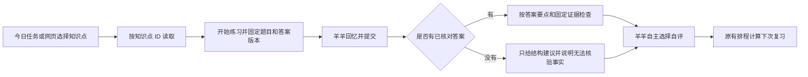

# 知识库 V2：本次实现与使用说明

日期：2026-09-26。本地代码已实现并验证主学习流程，尚未部署到云服务器，也未切换真实运行数据库。完整目标见 [设计方案](KNOWLEDGE-V2-DESIGN.md)，本文件说明实际范围。

## 1. 系统出题后的准确对应



主路径不按标题重新搜索。网页先创建 `practice_session`，服务端保存题目快照；飞书沿用已选中任务快照。提交答案和反馈继续使用该快照。更新教材影响新练习，不改写已开始练习和历史反馈。

同名知识点通过 ID 区分；同一提交键不能用于另一道题。已撤销、隐藏的知识点不能绕过可见性检查作答。管理员可以维护教材、参考答案、关系，不能代替羊羊作答、自评、加入个人学习范围或发起个人抽查。

## 2. 实际可用功能

| 业务 | 当前行为 |
|---|---|
| PDF 教材 | 开发电脑离线解析后导入；线上保留原件、文字和页码供查询，默认不加入个人练习，不产生遗忘事件 |
| 遗忘照片 | 保留 OCR 和修订记录；同范围教材优先匹配，形成校正建议；羊羊显式确认后采用 |
| 参考答案 | 网页拆分答案要点，绑定原文；验证引用确实存在及版本未变，保存核对人和版本 |
| 背诵反馈 | 逐要点判断覆盖、部分覆盖、遗漏、冲突或待核对；保存证据 ID 和羊羊原话；不打总分、不代选自评 |
| 局部图谱 | 一跳已确认关系；可添加/移除包含、对比、易混淆、前置关系；有向关系拒绝循环 |
| 网页浏览 | 按来源或学习范围筛选，分页 30 条；点开取原文，查看最近学习记录，进入回忆 |
| 随机抽查 | 从已加入范围且有当前有效核对答案的知识点选择，跳过当天已复习、已抽过的题 |
| 检索 | 标题/正文关键词匹配；命中位置的完整句段摘录；SQLite 模式有 FTS5 召回和排序 |
| 数据保护 | JSON → SQLite 迁移；运行数据及附件完整备份/恢复；知识快照保留答案版本和关系 |

“教材转写已核对”与“本题参考答案已核对”是两个状态。PDF 入库不会自动成为标准答案。资料修订或引用撤销后，对应答案提示重新核对；旧练习保留当时的引用快照。

图谱需要核对并添加关系，不会凭相似文字自动连边。服务器最多返回 50 节点、100 条边；画布展示最多 12 个邻居，手机最多 6 个，其余通过相邻知识列表进入。它是关系浏览器，不是完整的 Obsidian 笔记编辑器。

## 3. 检索工具与上下文

`apps/api/src/agent/knowledge-tools.js` 提供四个只读后端适配器：

| 方法 | 当前返回 |
|---|---|
| `searchKnowledge(query)` | 默认 3 条候选，上限 8 条，每条相关摘录最长约 2,200 字 |
| `getKnowledgePoint(id)` | 精确摘要、答案状态、最多 3 个答案要点；省略时标 truncated |
| `getSourceExcerpt(id, {version, query})` | 相关句段、页码；版本变化返回冲突 |
| `getKnowledgeRelations(id)` | 有界关系摘要，不返回整图正文或个人学习记录 |

由已认证后端流程调用，没有新增无限 function-calling 循环。网页完整详情走 `KnowledgeWorkspace`；练习走 `StudyService` 的固定快照，不靠搜索选“相似题”。群内照片核对沿用同范围查询，不把网页共享范围扩大成群聊权限。

JSON 模式按文字匹配排序；SQLite 使用中文预分词、双字索引、FTS5/BM25 召回，再按标题/正文命中排序。仍是词面全文检索，不是向量语义搜索。它可以作为 RAG 的检索步骤；RAG 不要求必须使用向量数据库。

模型学习摘要最多有 5 个任务标题；闲聊使用最近 6 轮短消息、至多 3 个片段；陪练取本题有界提示依据；事实反馈按一个答案要点分次处理。模型请求统一检查 60,000 UTF-8 字节文本上限，超限明确失败。字节上限不是精确 token 计量，也不等于图片 token 预算。

## 4. 数据库与备份启用

默认继续用原 JSON，不会启动即迁移。`DATA_FILE` 指向 `.sqlite` 或 `.db` 才启用 SQLite。当前为兼容迁移层：集合分行保存，知识点投影与 FTS 建索引；搜索和部分 ID 读取直接查索引。部分历史业务仍重建兼容对象并执行同步，尚未完成设计中的独立业务表和全量增量投影。

以下是**部署示例，尚未对真实服务器执行**。附件继续在数据库旁的 `knowledge-assets/`、`knowledge-library/`；没有开通 OSS。

1. 完成依赖安装、测试和容器构建，确认持久卷。
2. 停止应用写入，备份完整运行数据。

```text
node scripts/runtime-backup.mjs backup --source /data/review-assistant.json --output /backups/knowledge-v2-before --server-stopped
```

3. 预览迁移，核对 ID、来源分类、历史关联。`legacy_unknown` 不会被猜成教材并删除历史。

```text
node scripts/migrate-knowledge-v2.mjs --source /data/review-assistant.json --target /data/review-assistant.sqlite
```

4. 生成新库，并做恢复演练。

```text
node scripts/migrate-knowledge-v2.mjs --source /data/review-assistant.json --target /data/review-assistant.sqlite --apply --server-stopped
node scripts/runtime-backup.mjs restore --source /backups/knowledge-v2-before --output /restore-check/knowledge-v2
```

5. `DATA_FILE` 切到新库，启动单一实例，检查原文、待办、旧答案和历史日期。切换前失败可用原 JSON；新库已有新写入后不能直接退回旧 JSON 丢失增量。

`runtime-backup` 含个人学习历史，须作为私有备份放 Git 以外。知识快照 export/restore/merge 用于资料分发；V3 增加核对答案和关系，不导入个人 enrollment、作答、自评；答案版本或关系冲突时拒绝覆盖。两类备份不能互相替代。

## 5. 验证与剩余工作

- 清理在线 PDF 入口后，全量 88 项测试在本机 Node.js 24 和 Linux 容器 Node.js 20 均通过；覆盖 ID/版本、检索、权限、引用、图谱、反馈、备份恢复、迁移以及旧 PDF 配置不再触发解析。
- 独立合成数据上实际操作登录、选题、作答、查看参考、自评生成下次日期；检查桌面/手机布局。未使用真实学习数据或付费模型做这轮页面验证。
- `node scripts/evaluate-retrieval.mjs --scale 1000`：1,007 条合成资料，7 个可回答回归查询 Top5 均命中，3 个无依据/权限负例均无返回；本机建索引约 324 ms，10 次查询观测 P95 0.80 ms；容器回归同样全部通过。这不代表真实教材准确率或云端并发性能。
- Alpine 生产镜像构建成功；容器中的 JSON 与 SQLite 启动、登录、知识查询、匿名权限及旧 PDF 接口撤回检查均通过。本地检查不能替代 GitHub Actions，每次提交仍需通过远端 CI。详见 [本次检查记录](RELEASE-CI-2026-09-26.md)。

完整设计未完成项：三本真实教材与真实遗忘照片的人工标注/模型效果验收；重复照片和跨教材同一概念的人工归并、稳定映射；来源/章节/知识点完全分表、增量同步；更细章节导航、图谱学习状态筛选、按章节分层抽样；云服务器容量与并发实测。

语义召回、重排、正式 FSRS、主动定时推送、OSS 为后续增强，本次未开启。PDF 在线入口已撤回，教材走离线整理/快照导入路径。

下一步核心验收：挑选真实知识点，核对“原文 → 答案要点 → 题目 → 作答反馈”是否一致，再逐批扩大已核对答案范围。评测脚本支持 `--dataset` 和只读 `--database`；真实评测需人工认可的目标 ID，不能以模型自评宣称达标。
